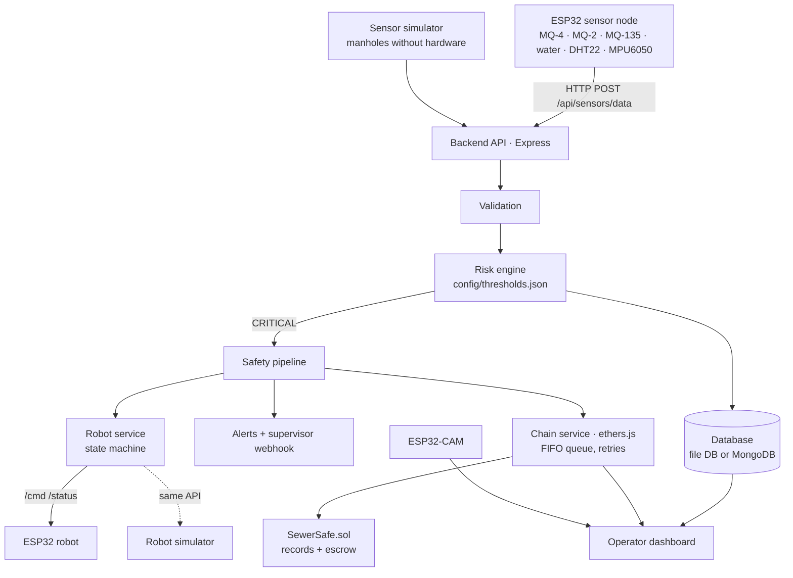

# SewerSafe

**IoT and blockchain-based smart sewer monitoring and robotic assistance system.**

SewerSafe keeps people out of hazardous sewers. Sensors watch each manhole. When the air turns dangerous, the system blocks human entry, alerts the supervisor, sends a robot to inspect instead, and writes a tamper-evident record to the blockchain. Maintenance contractors are paid from escrow only when a robot proves the job was done without anyone going in.

```
SENSE  →  DECIDE  →  ACT  →  TRUST
sensors   risk engine   block entry, alert,   database + on-chain record,
                        deploy robot          escrow payment on robot proof
```

> **Safety principle.** This system exists to prevent human entry. It must never be used to decide that a real sewer is safe to enter. The prototype uses a miniature sewer model and uncalibrated MQ gas sensors. Never test it by sending a person into a real sewer.

---

## 1. The problem

- The Government of India told the Lok Sabha that **498 workers died cleaning sewers and septic tanks between January 2019 and June 2026**, including 47 in 2025 ([Business Standard](https://www.business-standard.com/india-news/sanitation-workers-sewer-septic-tank-cleaning-deaths-since-2019-126080500881_1.html), [Scroll](https://scroll.in/latest/1094652/47-died-while-cleaning-sewers-septic-tanks-in-2025-says-centre)).
- The rights group DASAM documented 66 deaths for February–July 2026, against 16 reported officially for January–June 2026, and says deaths get recorded as "accidents" or "drowning" instead ([Counterview](https://www.counterview.in/2026/07/66-sanitation-workers-died-cleaning.html)).
- Manual scavenging has been banned since 2013. Sewer-cleaning robots already work in Indian cities (for example [Genrobotics' Bandicoot](https://www.sanitation.genrobotics.com/bandicoot)). People are still sent in, because it's cheaper and nobody can prove afterwards which method was used.

## 2. The solution

| Stage | What SewerSafe does |
|---|---|
| **Sense** | ESP32 nodes measure methane, combustible gas, air quality, water level, temperature, humidity and manhole-cover tilt. |
| **Decide** | A configurable risk engine classifies each reading as SAFE, WARNING or CRITICAL. Missing data from an installed sensor counts as a fault, never as safe. |
| **Act** | On CRITICAL: **HUMAN ENTRY BLOCKED**, alert, supervisor notification, automatic robot deployment, inspection record. Opening the cover while blocked raises an entry-attempt alert. |
| **Trust** | Hazards, robot deployments, inspection results and maintenance go on-chain as events plus a hash of the full report. Anyone can check that the database wasn't edited afterwards. Maintenance is paid from escrow only on a robot-signed proof; an entry attempt forfeits the contractor's bond to a worker welfare fund. |

**Why blockchain, not just a database?** The city, contractors and workers' groups don't trust each other, and whoever runs a database can quietly edit it. That is exactly how deaths get relabelled. On-chain hashes make any later edit detectable (the dashboard shows **MISMATCH**), and escrow makes the payment rule automatic.

## 3. Architecture



## 4. Repository layout

```
backend/      API, validation, risk engine, safety pipeline, robot service, chain service, storage
frontend/     operator dashboard (plain HTML/CSS/JS, served by the backend, no build step)
contracts/    SewerSafe.sol: inspection records + robot-verified escrow
firmware/     ESP32 sensor node, ESP32 robot, wiring and flashing guide
config/       thresholds.json (risk engine), sewers.json (monitored manholes)
scripts/      start.js (one-click launcher), deploy / job / release / status
tools/        fake ESP32 robot + fake ESP32 sensor node (same protocol as the firmware)
test/         contract tests + END-TO-END test on a real local blockchain
backend/test/ unit and API tests
robot/        optional Raspberry Pi robot that signs its own proofs (docs/raspberry-pi-robot.md)
docs/         step-by-step guide, Pi robot guide, offline pitch simulation
```

## 5. Hardware

Full wiring tables and flashing steps are in [`firmware/README.md`](firmware/README.md).

| Unit | Parts |
|---|---|
| Sensor node | ESP32, MQ-4 (methane), MQ-2 (combustible), MQ-135 (air quality), water-level sensor, DHT22, MPU6050 on the manhole cover, red LED, buzzer. Optional O₂ sensor. |
| Robot | ESP32, 2WD chassis, 2 DC motors, L298N, HC-SR04 ultrasonic, headlight LED, 2×18650 pack |
| Camera | ESP32-CAM (AI-Thinker) running the stock CameraWebServer example |
| Model | Miniature sewer: a PVC pipe section and a small "manhole" box |

Everything also runs **with no hardware**: simulated sensors, a simulated robot and a mock camera view drawn from the robot's real telemetry.

## 6. Software

- **Backend:** Node.js 18+, Express, ethers.js v6. No build step.
- **Database:** built-in JSON file database by default (`data/sewersafe-db.json`, nothing to install). Set `MONGODB_URI` to use MongoDB with the same interface.
- **Blockchain:** Solidity 0.8.24, Hardhat. Local Hardhat chain for the demo; MST Blockchain testnet (EVM, chain ID 91562037) for the real network.
- **Frontend:** plain HTML/CSS/JS, polled once a second.
- **Firmware:** Arduino (esp32 core 2.x and 3.x).

## 7. Risk engine

Thresholds live in [`config/thresholds.json`](config/thresholds.json). Edit and restart.

| Reading | Warning | Critical | Basis |
|---|---|---|---|
| Methane (MQ-4, indicative ppm) | 1000 | 5000 | 5000 ppm = 10% of methane's lower explosive limit |
| Combustible gas (MQ-2) | 1000 | 5000 | same scale |
| Air quality (MQ-135 relative index) | 150 | 300 | relative index, no official unit |
| H₂S (if fitted) | 10 ppm | 20 ppm | NIOSH 10-min ceiling / OSHA ceiling |
| Oxygen | < 20.0% or > 22.5% | < 19.5% or > 23.5% | OSHA oxygen-deficient / enriched limits |
| Water level | 60% | 85% | prototype |
| Temperature | 40 °C | 50 °C | prototype |

Each reading gets a 0–100 score. Several hazards raise the score, and **three simultaneous warnings escalate to CRITICAL**. Response:

```json
{ "risk_level": "CRITICAL", "risk_score": 92, "triggered_hazards": ["HIGH_METHANE", "LOW_OXYGEN"],
  "recommended_action": "BLOCK_HUMAN_ENTRY_AND_DEPLOY_ROBOT", "human_entry": "BLOCKED" }
```

Human entry is never "allowed". The best status is `ROBOT_FIRST`. No data for 60 s marks a sewer OFFLINE and BLOCKED. Readings are validated for missing, non-numeric, out-of-range, stale (> 30 s) and future-dated values. **MQ readings are uncalibrated indicators, not certified gas measurements.**

## 8. Robot

States: `IDLE → MOVING ⇄ INSPECTING → OBSTACLE → RETURNING → COMPLETED` (or `ERROR`). Commands: `forward`, `backward`, `left`, `right`, `stop`.

On CRITICAL the robot is deployed automatically. It drives into the pipe, stops at checkpoints to record gas readings, stops before obstacles and drives back. An operator can take over at any time (manual control aborts the autopilot). The simulator and the ESP32 driver share one interface; set `ROBOT_DRIVER=esp32` and `ROBOT_URL` to switch.

The ESP32 firmware enforces its own safety: every command is a short pulse (motors stop if the network drops), and it refuses to drive forward within 15 cm of an obstacle.

## 9. Blockchain

Contract: [`contracts/SewerSafe.sol`](contracts/SewerSafe.sol).

| Function | When |
|---|---|
| `recordHazard(id, sewerId, risk, score, hazards, reportHash)` | CRITICAL detected |
| `recordRobotDeployment(id, robotId)` | robot sent in |
| `recordInspection({...})` | inspection finished (and when an entry attempt is added) |
| `recordMaintenanceCompletion(id, reportHash)` | blockage cleared |
| `postJob` / `submitProof` / `release` | maintenance escrow: paid only on a robot-signed proof with no human detected |
| `getInspection(id)` | verification |

Only the key events and a **keccak256 hash of the full report** go on-chain; detailed readings stay in the database. The backend writes through one strict first-in-first-out queue. If the chain is down, records wait as PENDING and retry. `GET /api/blockchain/inspection/:id` recomputes the hash from the database and compares: **VERIFIED**, **MISMATCH** (the database was edited) or **PENDING_CONFIRMATION**.

For ESP32 robots, the backend signs proofs on the robot's behalf with `ROBOT_GATEWAY_KEY`. The optional Raspberry Pi robot ([docs/raspberry-pi-robot.md](docs/raspberry-pi-robot.md)) signs with its own key instead, which is the stronger design.

## 10. Setup

**Requirements:** [Node.js](https://nodejs.org) 18 or newer (LTS recommended). That's all for the demo.

```bash
git clone https://github.com/BidishaRajbanshi/North-KTM.git
cd North-KTM
npm start
```

Or double-click **`START-DEMO.bat`** (Windows) / **`START-DEMO.command`** (Mac). The first run installs packages (1–3 minutes). Then it starts a local blockchain, deploys the contract, starts the backend and opens **http://localhost:4000**. Press Ctrl+C to stop.

Step-by-step instructions for beginners, including the ESP32 hardware, are in [`docs/GUIDE.md`](docs/GUIDE.md).

## 11. Environment variables

Copy `.env.example` to `.env`. For the local demo nothing needs changing. **Never commit `.env`.**

| Variable | Purpose | Default |
|---|---|---|
| `PORT` | backend port | 4000 |
| `SIMULATE_SENSORS` | simulate manholes without hardware | true |
| `DEVICE_API_KEY` | ESP32 must send it as `x-api-key` | off |
| `OPERATOR_TOKEN` | control endpoints require `x-operator-token` | off |
| `CORS_ORIGINS` | comma-separated origins allowed to call the API from a browser | none (same-origin only) |
| `MONGODB_URI` | use MongoDB instead of the file DB | file DB |
| `ROBOT_DRIVER`, `ROBOT_URL` | `sim` or `esp32` + the robot's address | sim |
| `CAMERA_URL` | ESP32-CAM stream | mock camera |
| `ROBOT_SEGMENT_M`, `ROBOT_STEP_M`, `ROBOT_CHECKPOINT_M` | mission geometry | sim 10/0.5/2.5 m, esp32 2/0.1/0.5 m |
| `SUPERVISOR_WEBHOOK_URL` | POST alerts to Slack, n8n, etc. | log only |
| `CHAIN_RPC` | blockchain RPC | local chain |
| `MST_PRIVATE_KEY`, `CONTRACTOR_KEY`, `ROBOT_GATEWAY_KEY`, `ROBOT_ADDRESS`, `RECORDER_KEY` | wallets for a real network | local test keys |

## 12. Running

| Command | What it does |
|---|---|
| `npm start` | everything (local chain, contract, backend, dashboard) |
| `npm run server` | backend only (uses `CHAIN_RPC` and `deployment.json`) |
| `npm run fake:robot` | fake ESP32 robot on port 8081 |
| `npm run fake:sensor` | fake ESP32 node sending dangerous gas on S101 |
| `npm run deploy:testnet` | deploy to MST testnet (fill `.env` first) |

### API

| Method | Path | |
|---|---|---|
| GET | `/api/sewers`, `/api/sewers/:id` | live state, readings history |
| POST | `/api/sensors/data` | ingest a reading (device key if set) |
| POST | `/api/risk/analyze` | stateless risk check |
| GET/POST | `/api/alerts`, POST `/api/alerts/:id/ack` | alerts |
| GET/POST | `/api/inspections`, GET `/api/inspections/:id` | inspections (POST sends the robot) |
| POST | `/api/robot/command`, GET `/api/robot/status` | robot |
| POST | `/api/blockchain/record`, GET `/api/blockchain/inspection/:id` | record / verify on-chain |
| GET/POST | `/api/maintenance`, `/api/maintenance/:id/complete` | escrow-paid maintenance |
| POST | `/api/demo/critical`, `/api/demo/entry-attempt`, `/api/demo/tamper`, `/api/demo/reset` | demo mode |

Errors always look like `{ "error": { "code": "STALE_READING", "message": "...", "details": [...] } }`.

## 13. Demo mode

On the dashboard, press **Simulate critical hazard**. A 12-step tracker lights up as each step happens:

1. dangerous gas simulated → 2. risk engine CRITICAL → 3. dashboard changes → 4. **HUMAN ENTRY BLOCKED** → 5. alert and supervisor notified → 6. robot deployed → 7. robot enters the sewer → 8. camera view → 9. inspection completes → 10. database record → 11. blockchain event → 12. verified on-chain.

Then:

- **Run cleaning robot** on the maintenance job: a robot proof is accepted and the contractor is **PAID** from escrow after the inspector window.
- **Entry attempt**: a critical alert fires and the contractor's bond is **SLASHED** on-chain.
- **Tamper latest record**: the database is edited and verification turns **MISMATCH**.

## 14. Testing

```bash
npm test
```

- **Backend (50 tests):** sensor validation, risk engine (SAFE/WARNING/CRITICAL, combined hazards, sensor faults, configurable thresholds), storage, robot state machine and commands, ESP32 HTTP protocol, every API endpoint, alerts, inspections, auth, tamper detection, escrow, entry attempts.
- **Contracts (18 tests):** records, access control, escrow, human-entry slashing, and the **end-to-end test on a real local blockchain**:
  `CRITICAL SENSOR → CRITICAL RISK → HUMAN ENTRY BLOCKED → ALERT → ROBOT DEPLOYED → INSPECTION → DATABASE RECORD → BLOCKCHAIN RECORD → VERIFIED`, plus payment, slashing and tamper detection checked against real on-chain state.

**Not tested:** the ESP32 firmware has not been compiled or run on hardware (the build machine couldn't download the toolchain). The MongoDB adapter hasn't been run against a live MongoDB. The MST testnet deployment hasn't been run from here. Compile, flash and deploy before the event.

## 15. Safety limitations

- MQ sensors are **uncalibrated indicators**. They drift with temperature and humidity and react to many gases. A real deployment needs certified, calibrated multi-gas detectors.
- The risk engine is a threshold model, not a certified safety system.
- "Human entry blocked" is a status and an alert, not a physical lock.
- Without wheel encoders, the ESP32 robot's position is estimated from pulse counts.
- ESP32 robot proofs are signed by the backend gateway, not on the robot itself.
- Test only on a miniature model.

## 16. Future improvements

Certified electrochemical gas sensors (H₂S, CO, O₂, LEL); secure element (ATECC608A) on the robot so it signs its own proofs; NTAG 424 DNA manhole tags; wheel encoders; MQTT for many nodes; a smart manhole-cover lock tied to the entry block; SMS and WhatsApp alerts; IPFS for evidence files; integration with the NAMASTE scheme's worker registry.
